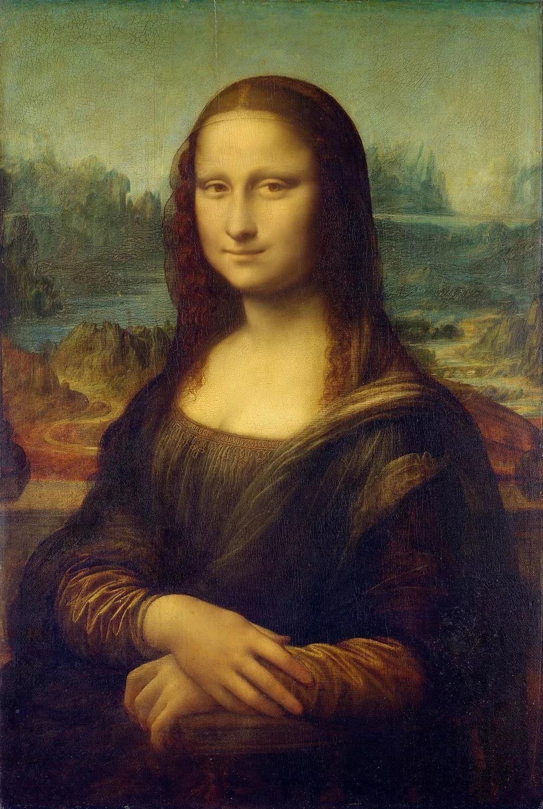

# Project: Can you recognize the emotion from an image of a face? 


### [Full Project Description](doc/project3_desc.md)

Term: Fall 2019

+ Team ##
+ Team members
	+ 1 Thomson Batidzirai
	+ 2 Feichi Gu
	+ 3 Chang Qu
	+ 4 Young Sim
	+ 5 Mo Yang
	

+ Project summary: In this project, we created a classification engine for facial emotion recognition. 
	
**Contribution statement**: 
+ Feichi Gu
   
	+ Data processing, include data splitting and cleaning 
	+ Build the HOG and PCA function and Extract HOG and PCA features (pick the best parameter of HOG and PCA)
	+ Choose 23 points to calculat the distance between them, build our own features 
	
+ Mo Yang          
                
	+ Conduct image exploration before extracting new features, and Review those previous researches in this area.
	+ Build the RGB function and Extract RGB features
	+ Generate README.Rmd 
	
+ Young Sim  
               
	+ Train and test SVM (linear and non-linear) model based on PCA, HOG, RGB and the features we choose by ourselves (pick the best parameter of SVM model, test using cross validation) 
	+ Generate main.Rmd 
	
	
+ Chang Qu  
        
	+ Train and test MLPClassifier Neural Network model (using Python)based on SIFT, HOG, RGB and HSV  
	(pick the best parameter of Neural Network model, test using cross validation) 
	
+ Thomson Batidzirai  
        
    + Train and test gradient XGboosting  model based on PCA, HOG, RGB and Features we choose by ourselves.
    + Make the PPT and give the presentation


Following [suggestions](http://nicercode.github.io/blog/2013-04-05-projects/) by [RICH FITZJOHN](http://nicercode.github.io/about/#Team) (@richfitz). This folder is orgarnized as follows.

```
proj/
├── lib/
├── data/
├── doc/
├── figs/
└── output/
```

Please see each subfolder for a README file.
